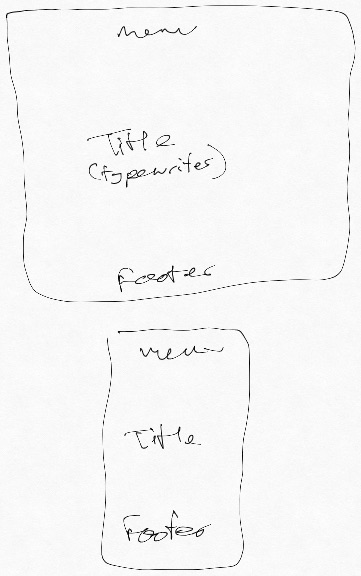
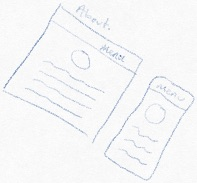
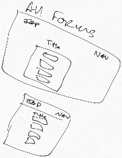
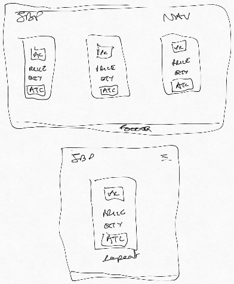
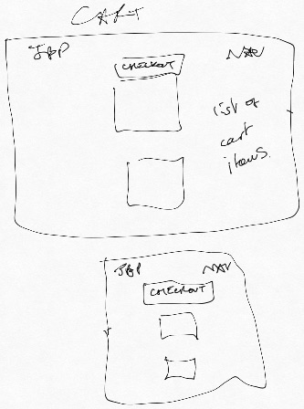

# Jamie Boyd Photography

# Milestone Project 4
## Description
---
This is my fourth Milestone project of the Full Stack Software Development course from Code Institute.
This project is designed to pull together everything we have learned over the duration of the course. 
The main focus of this project is using python and Django with a SQL database, whilst also harnessing the 
Javascript, HTML and CSS skills we have previously learnt.

[Jamie Boyd Photography](https://jamieboydphotography.herokuapp.com/)

## Development
---
To develop this project i decided to use Django 3. Although the course was taught using Django 1 I wanted to try and get 
myself familiar with the newest tech, especially given it is only a couple of months old (at the time of writing). This 
created some learning curves where things were done slightly differently, namely the urls. One of the huge benefits of 
Django is that it takes care of a lot of things under the hood which lends itself to fast deployment. Another benefit is 
that you create different sections of your site in individual 'apps' with he premise that you can re-use the 
functionality on future sites.

Throughout development I used Git and GitHub for version control. Firstly, I made sure my site was deployed correctly 
based on the master branch in GitHub. Once setup was successful, I started to develop on different branches. This 
allowed me to test rigorously on a separate branch and only move onto the master branch once I was happy everything 
was working as it should be.

PyCharm was my choice of IDE this time around. I like its debugging features and it works really well with Django.

Additionally, I chose to use Postgres as my database as this is more scalable as your app grows.

The app is deployed on Heroku, and all environment variables are stored locally in an env.py file. This was added to 
a .gitignore file so all of the values were kept a secret.

### Note
When testing this project, to make a payment via the store, the below details should be used:
* Card Number: 4242424242424242
* CVC: Any 3 digit number
* Expiry Date: Any future date.

Anything not matching the above will receive an error.

## UX/UI
---
### User Stories
#### Site Users
* I want the ability to browse the website on any device.
* I want to be able to register an account on the website in order to gain further access.
* I want to be able to view the photographers images.
* I want to be able to view blog posts, and add a comment if I am logged in.
* I want the ability to edit and delete any comments that belongs to myself but not others.
* I want to ability to buy images. I want to be able to add them to my cart and the view my cart at any stage.
* I want to be able to adjust the quantity of items in my cart or completely remove them.
* I want to be able to contact the business owner if the need every arises.
* I want to be able to logout of my account.

### Site Owner
* I want the ability to add blog posts from the admin site and publish when complete.
* I want the ability to remove any comments from blog posts if they include profanity.
* I want the ability to revoke a users access should the repeatedly do the above.
* I want the ability to add and remove images to the gallery from the admin panel.
* I want the ability to add new images to the store and remove also via the admin panel.
* I want all users (regardless of device) to have a positive user experience.
* I want to be able to be contacted by a user should they deem in necessary.
* I want to be able to see a record of orders in the admin site.

### Design
I chose to go with a minimalistic design for this website. Minimalistic website are by far 
my favourite to look at. I really enjoy a super simple design to look at and this was the inspiration 
here. Another big favourite of mine is dark mode. I love to look at websites that are majority dark and 
again that drove the inspiration here. I dont like pure black, so I looked at different shades to see what 
I thought would work best. I landed on `#121212`. This makes up the majority of the site and I think its a little 
more subtle than pure black. As with pure black, I also am not a fan of pure white. I think both just 
look far too contrasty so I went with a slightly off white in `#d7d9d7`. 

These colors make up 99% of the website. However, I'm also not a big fan of links being the typical blue 
and also being underlined. So I had to come up with a colour that would compliment the black and white well. 
Because this is primarily on top of a black background, I had to find a nice bright colour with enough contrast 
to ensure all users could easily see them. I first looked at an orangey colour but I felt it was no contrasty 
enough. Which is then how I landed upon the green. I had to ensure the links were obvious so the nice brightness 
made sense.

Again, keeping the minimalistic approach in mind, the Gallery in just purely images with the exception of a brief 
intro and some brief instructions. After all, the images are meant to be the main draw and main feature of the site, so 
it didnt make sense for any other information to be present.

Again, keeping to my minimalistic approach, I chose to keep the forms pages minimal by only having the 
forms present.

For the blogs page, I had to go a little against the grain. I initially built the page without the box shadow 
feature in the css styles, and just used bootstrap cards to created a layout. However, when it came to completing
 all the other styles on the site, I felt as though something was missing on this page. I had to rethink my approach 
 for the benefit of the UI. I added the box shadow feature just to lift the cards off the page a little to 
 improve the look.
 
 For the flashed messages, I didnt like how it looked when it stayed on the page and interrupted the design. 
 To combat this I created some custom JS to remove the messages from the screen after 3 seconds.
 
 In terms of the font, I chose 'Arimo' because I wanted to use a font that wasn't super formal. This is a photography 
 site after all which is all about creativity. However, it is my personal opinion that its a very fine line with fonts 
 before they start looking gimmicky. 

### Wireframes

###Index

###About

###Gallery

###Blog Main Page

###Individual Blog Pages

###Forms

###Store

###Cart

## Features
---
#### Current Features
* Gallery - A page where I have picked a selection of my favourite images for users to browse.
* Store - Created somewhere to sell my best images. This is a small selection of my images which 
I consider to be my best.
* Blog - A section created so that I can share stories and thoughts about anything and everything 
to do with photography.
* User Accounts - Users are able to register and account on the site and login. This gives them the ability to use the 
store and add, edit and delete comments on blog posts.
* Contact Us - Give the user an opportunity to send a message to the business owner.

#### Future Features
* Forum - I may look to add a forum feature further down the line. This would allow users to start up conversations 
themselves and create somewhat of a community.
* A previous orders page, so a user can keep track of their orders.

#### Defensive Design
Throughout the build of this site various defensive features were added to protect against malicious activity, and 
also to stop things breaking.

* A `` was added on every form to prevent Cross Site Request Forgeries.

* Included in a lot of the views and a lot of the templates are checks to ensure that te user has been 
authenticated. This helps avoid somebody trying to login who is already logged in etc. But it also helps ensure 
only registered users are accessing certain functions, such as commenting and purchasing.

* Several checks were put in place within the forms and the models to ensure all requests were receiving all 
the expected data. Adding 'required' to certain field helped ensure this was achieved and fields were not left blank.

* In relation to stripe and payments, I added further checks to ensure the correct payment information 
was being entered. There is an issue with stripe where it allows you to process a payment with 
the cvc field blank. To combat this I entered some logic to ensure that field is always 3 digits otherwise 
an error will be returned. Another issue with stripe is that it will allow a 12 digit card number 
to be entered. So combat this I added a min and max length of 16 to the form.

* 404 and 500 error pages were created so that the user received a custom error rather than receiving the 
django standards.

## Database
I chose to take a different route to the majority of my peers with regards to the database. 
I decided to use Postgres for this project but rather than having one database for production 
and one for development, I decided to implement Postgres from the start. Because of the nature of my website 
I didn't feel there was any real need to use different databases as the content would be the same. 
### Models
I spent a lot of time preparing the models for this before creating the because I wanted to get them right 
the the first time. They were carefully thought out to ensure everything I could need was captured. I also wanted to 
take accessibility into consideration on my site, so I added an image description on the gallery and the store 
to enable me to pass it into the alt property on my images. I chose to use URL fields for the images due to me already 
having the images hosted on another platform, and this then enabled to upload once and grab from there.
* To add the models into the application, after completing the detail, I would make migrations by running 
`python manage.py makemigrations`. Once this was successfully done, I would run `python manage.py migrate` to 
actually move the table into the database. These commands were ran from the command line.

Postgres needs to be added as an add-on in Heroku.

## Technologies/Support Used
---
Below is a list of technologies I used to build my dashboard.
* HTML - HTML5 provided the structure of my website. I tried to use semantic elements where possible to ensure the best structure.
* CSS - Used to style my page.
* [Bootstrap](https://getbootstrap.com/) - Used primarily for the grid system. I find this a really good way to position my elements where I want them.
* [PyCharm](https://www.jetbrains.com/pycharm/) - This is my text editor. It has a built in terminal so I could do everything I needed to from one environment.
* [Git](https://git-scm.com) - Git was used for version control. Allowing me to create backups whenever significant changes were made to my code.
* [GitHub](https://github.com/) - This is where my repository is held externally. I will also use GitHub pages to deploy my website.
* [Google Fonts](https://fonts.google.com/) - Used to import specific fonts I wanted to use on my website.
* [Python](https://www.python.org/) - Python was the language used to build the backend of the website.
* [Django](https://www.djangoproject.com/) - Python framework used in order to build out the routes/views of my website.
* [Heroku](https://id.heroku.com/login) - I used Heroku to deploy my website.
* [Postgres](https://www.postgresql.org/) - I used Postgres as my database for development and production.
* [Typewriter.js](https://safi.me.uk/typewriterjs/) - I used the typewriter library for the typing feature on the home page.
* [Lightbox.js](https://lokeshdhakar.com/projects/lightbox2/) - I used this for the lightbox on the Gallery page.
* [Stripe](https://stripe.com/gb) - I used Stripe to process payments on the site.
* [WhiteNoise](http://whitenoise.evans.io/en/stable/django.html) - I used WhiteNoise to serve my static files.

## Testing
---
All of my testing was done manually for this project. I did however use automatic validators to check my code. They 
are detailed in the credits section at the bottom of the page. I used PEP8 for my Python code, and the W3C validator 
for my HTML and CSS code. I used all of these periodically throughout development to ensure I was always adhering to 
standards. Due to my usage of the Jinja templating system. I had to manually go through the errors and look which ones 
were valid as it doesn't recognise Jinja syntax.

My choice of browser for this project was firefox developer edition. This is my go to browser due to the really good dev tools.
The dev tools play a huge part in how I developed my website. When working on bug fixes or new styles I always use the dev tools 
first to see what they look like or if I can find whats causing the bug before implementing into my own code. The dev tools 
also play a major part in me using the mobile-first approach to designing and developing my website.

Although I primarily used firefox for development, i periodically checked how my site look in other modern browsers. 
Firefox, Chrome, Safari, Opera and Edge were all used to ensure all functionality was working across them all. In 
addition to testing on various browsers, I also ensure the site was responsive by testing on various mobile devices. 
Primarily, on iPhone and iPad.

Additionally, after realising the dev tools aren't always 100% accurate with certain things (see footer bug below), I 
got the help of my peer [Anthony](https://github.com/auxfuse/) to help test my site on non iOS mobile devices.

Further down the line, I also sent out the link to the deployed site to family and friends to get their feedback on design 
and responsiveness to ensure I had covered all my bases with regards to different devices.

## Notable Bugs and fixes
---
* The website doesn't work at all on IE. I was unable to find a fix for this so concentrated on making sure everything was 
working on modern browsers.

* I have a bug that is only visible on iOS devices. On the about page only, the footer does not stay at the bottom of the 
page. This isn't linked to a specific browser as I was able to replicate it on both Chrome and Safari on my iPhone and 
iPad. This issue doesn't actually appear in the devtools so I only noticed this when browsing the deployed site. I have 
various fixes for this including completely restructuring the page and playing with media queries to try and get it to 
work. Unfortunately this is an outstanding bug that I am still trying to fix.

* I ran into an issue when trying to adjust the quantity of an item in my cart to 0. I had the below code block in place 
`    if quantity > 0:
        cart[id] = quantity
    else:
        cart.pop(id)`. However, using the PyCharm debugger i realised that it didnt like the `cart.pop(id)` line. After 
        various attempts to fix, I spotted that the id was in fact being converted from an integer into a string, which 
        is what was causing the issue. Due to the fact I was using Django 3, I had to go in and amend the url for the 
        adjust_cart view to accept a string rather than an int. This fixed the issue.

* As previously mentioned, there is an issue with the cvv field and stripe allowing the field to be sent as blank. I tried 
to add min and max lengths to the forms in various ways to no avail. I came across a post in the CI slack community 
which detailed how it could be done using JS. I implemented the JS and adjusted it slightly to my use case. I believe 
number input fields from the forms module are able to accept min and max lengths in the form itself.

## Deployment
---
My website was created using PyCharm. PyCharm is an IDE with a built in terminal, however I chose to use
iTerm2 for my terminal. I chose to use a text editor/IDE 
outside of AWS Cloud9 to gain experience working outside of a browser. Once I had created my new Django project,
 I initiated a local repository using GIT which was downloaded onto my machine previously. I then created an 
external repository in GitHub and linked the local and external repositories. This allowed me to version control 
throughout the lifespan of the development.

* I created a new project in PyCharm.
* Created a new virtual environment.
* I then created a local git repo.
* I then linked my local git repository to a GitHub repository.
* I then followed the below steps to deploy the site to Heroku.

To deploy the website to Heroku, I followed the below steps:
* Created a new project.
* From the deployment method section of the Deploy tab, I selected GitHub, and then entered my github repo link in the 
field provided.
* Every time I push to GitHub master branch it will automatically send the updates across to Heroku.
* I then also had to create some Config Vars in the settings tab, to reflect the environment variables created 
in the env.py file. This file was added to a .gitignore file to ensure the security of sensitive information.
* [Website Link](https://jamieboydphotography.herokuapp.com/)

### To run this project locally

* Follow this link to the [GitHub Repository](https://github.com/jboyd8/jamieboydphotography)
* Click on the 'Clone or Download' button.
* Copy the URL provided.
* Open a bash terminal, move to your desired directory.
* Type 'git clone' and paste in the URL.
* Create an env.py file and store three environment variables. The environment variables required are (SECRET_KEY, DATABASE_URL, 
STRIPE_PUBLISHABLE, STRIPE_SECRET). In addition to these you will need to setup email variables here too.

## Credits
---
* To my mentor, [Reuben Ferrante](https://github.com/arex18), for guiding me through the process and offering assistance when necessary to point me in the right direction.
* The Slack community. The help a student is able to receive from the other students is a really great tool to have.
* [HTML Color Code](https://htmlcolorcodes.com/) - Used this website in order to obtain hex codes whilst styling my pages.
* [W3C Validator](https://validator.w3.org/#validate_by_input) - A validator used to check my HTML and CSS structure and format periodically throughout the build.
* [CSS Autoprefixer](https://autoprefixer.github.io/) - Used to prefix CSS for browser support.
* [PEP8](http://pep8online.com/) - Python validator to ensure my code adhered to PEP8 standards.
* Concepts iOS app - Used to build wireframes.

